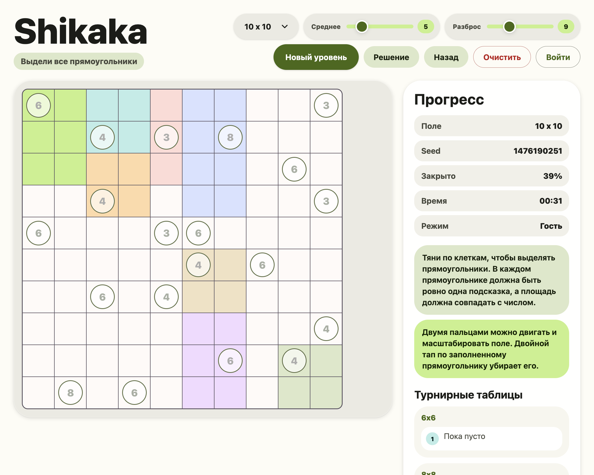
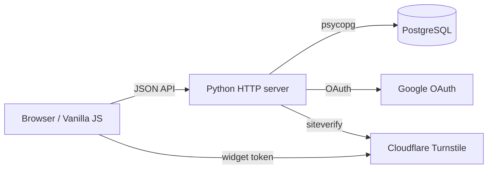

# Shikaka

Web implementation of the Shikaku puzzle game with generated levels, saved progress, Google sign-in, guest mode, leaderboards, and PostgreSQL persistence.



## Current Stack

- Frontend: vanilla JavaScript in `public/app.js`, HTML/CSS in `public/index.html` and `public/style.css`.
- UI: Material Web Components loaded from CDN, no frontend build step.
- Backend: Python `http.server` in `server.py`.
- Database: PostgreSQL via `psycopg[binary]`.
- Auth: Google OAuth for accounts, guest mode without server account.
- Bot protection: Cloudflare Turnstile on Google sign-in when configured.

`server.js` is kept as a legacy Node reference/fallback. The active backend is `server.py`; `npm start` runs the Python server.

## Features

- Preset Shikaku boards: `6x6`, `8x8`, `10x10`, `15x15`, `20x20`, `26x26`.
- Advanced generator settings for board size, median area, and spread.
- Undo, clear, reveal solution, double-tap/click to remove a filled rectangle.
- Mobile board navigation with two-finger pan/zoom.
- Guest play stored locally in the browser.
- Google-authenticated play stored in PostgreSQL.
- Leaderboards grouped by preset board size.
- User statistics:
  - successful preset completions;
  - unsuccessful preset attempts when the solution is revealed or a new level is started before completing the old one.
- Custom generator settings are playable, but only exact preset configurations are counted in statistics and leaderboards.

## Architecture



## Local Setup

### Requirements

- Node.js >= 18
- Python >= 3.11
- PostgreSQL

### Install

```bash
cd /Users/bogdanleonov/FU/formayya/shikaka
python3 -m pip install -r requirements.txt
npm install
createdb shikaka
cp .env.example .env
npm start
```

Open:

```text
http://localhost:3000
```

Without Google OAuth variables, the app still works in guest mode.

## Environment

`.env.example` contains the supported variables:

```env
PORT=3000
SESSION_SECRET=long-random-string-for-sessions
PUBLIC_BASE_URL=http://localhost:3000

GOOGLE_CLIENT_ID=
GOOGLE_CLIENT_SECRET=

TURNSTILE_SITE_KEY=
TURNSTILE_SECRET_KEY=

DATABASE_URL=postgres://localhost:5432/shikaka
```

Important:

- `TURNSTILE_SITE_KEY` is public and can be sent to the browser.
- `TURNSTILE_SECRET_KEY` must only live in `.env` on the server.
- There is no password login anymore. Users either play as guest or sign in with Google.

## Google OAuth

Google sign-in is enabled when both variables are set:

```env
GOOGLE_CLIENT_ID=...apps.googleusercontent.com
GOOGLE_CLIENT_SECRET=...
```

For local development, configure this redirect URI in Google Cloud Console:

```text
http://localhost:3000/auth/google/callback
```

For production with DuckDNS:

```env
PUBLIC_BASE_URL=http://shikaka.duckdns.org
```

And configure this redirect URI:

```text
http://shikaka.duckdns.org/auth/google/callback
```

If HTTPS is added later, change both `PUBLIC_BASE_URL` and the Google redirect URI to `https://...`.

## Cloudflare Turnstile

Turnstile protects the Google sign-in start endpoint. It does not require moving DuckDNS to Cloudflare DNS.

In Cloudflare:

1. Open Turnstile.
2. Create a widget.
3. Add hostname:
   ```text
   shikaka.duckdns.org
   ```
4. Copy the site key and secret key.

On the server, edit `~/shikaka/.env`:

```env
TURNSTILE_SITE_KEY=0x4AAAAAADGkaXSx06lO-6ct
TURNSTILE_SECRET_KEY=your-secret-key-from-cloudflare
```

Restart the app after changing `.env`.

## Deployment

This repo includes `deploy.sh`, which checks the project, copies files to the server, installs Python dependencies, and restarts the service:

```bash
./deploy.sh
```

Manual server commands:

```bash
ssh -l bogdan 111.88.150.78
cd ~/shikaka
nano .env
sudo systemctl restart shikaka
systemctl is-active shikaka
```

The production `.env` should look like:

```env
PORT=3000
SESSION_SECRET=long-random-string
DATABASE_URL=postgres://localhost:5432/shikaka
PUBLIC_BASE_URL=http://shikaka.duckdns.org
GOOGLE_CLIENT_ID=...apps.googleusercontent.com
GOOGLE_CLIENT_SECRET=...
TURNSTILE_SITE_KEY=0x...
TURNSTILE_SECRET_KEY=...
```

## Checks

Run before deploying:

```bash
npm run check
```

This checks:

- Python syntax for `server.py`;
- JavaScript syntax for `public/app.js`;
- JavaScript syntax for legacy `server.js`.

## Main Files

- `server.py`: active backend, auth, API, PostgreSQL persistence.
- `public/app.js`: game logic, rendering, generator, client API calls.
- `public/style.css`: Material 3 inspired visual styling and responsive layout.
- `public/index.html`: app shell and Material Web CDN imports.
- `.env.example`: environment variable template.
- `deploy.sh`: deployment helper for the current server.
